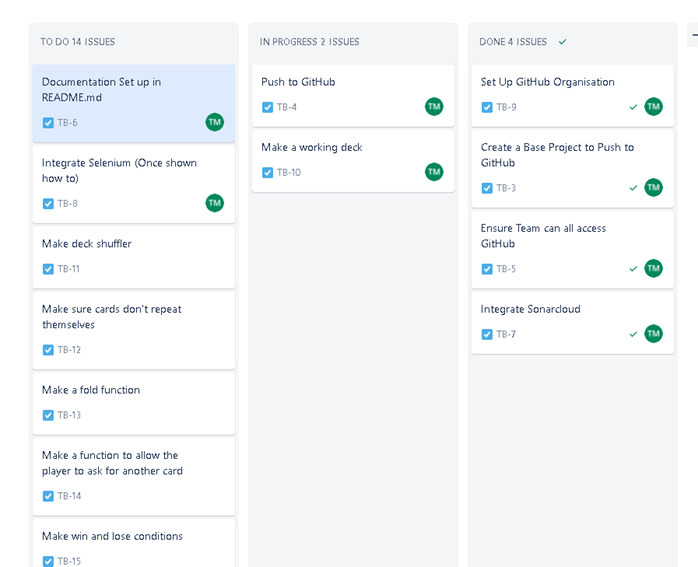

# Pair Coding
## _Project Documentation_

Testing Types
- Selenium for Black Box (Human stand in automation)
- Cucumber (Acceptance Testing)
- Code Coverage (Statement & Decision)
- JUnit
- - Does it make 4 suits of 13 cards
- - Does each suit contain 3 picture cards?
- - Does it randomise the cards?
- - Do any of the cards repeat?
- - Can you request another card?
- - Can you fold?
- - Do you lose over 21?
- - Do you win if dealer over 21?
- - Do you lose if both below 21 and dealer is higher?
- - Do you lose if both below 21 and you are higher?
- - Can Ace be 1 & 11?
- - Do you start with X amount in your pot?
- - Can you place a bet?
- - Does your pot increase correctly on a win?
- - Does your pot decrease correctly on a loss?
- - Does drawing a card display the correct card image?

Future improvements  
- Multiplayer  
- Better graphics 
- Additional rules (i.e. split) 
- Saving progress  
- Story mode  
- Customize character  
- Trophy system  

# Risk  Assessment
## _Strengths_ 
- We are using Ashes code
- It is a realtivly simple idea 
## _Weaknesses_ 
- We are inexpereinced and incompetent
- Too much work put into hte sprint
- Lack of time (Made worse by the deadline being brought forward a week)

# Version Control
Git hub will be used as the version control system for all of the branches (Main, master and react and release)

# Testing

Most testing will be done using Junit and the overall code coverage will checked in a quality gate in sonarcloud 

# Documentation Needs
- Describe Architecture (Services, and how everything talks to each other)
- Production Environment (Map of end user intefaces)
- Dev Environment
- Tools
- Takeaways from previous projects
- Method (How we made the thing)
REGULARLY PUSH TO AVOID MAJOR CLASHES
- Risk Assessment (SWOT)
- Testing (Every tool & how you're using)
- Cite Code Snippet
- Highlight Pitfalls in Replication

# Takeaway from previous project  

The main takeaway from previous projects is that we are now more aware of our shortcomings and can focus more on those aspects to ensure that they will not come up in this project. Additionally we have learnt to put in the time, if we focus and keep each other from being distracted the work will get done better and it’ll get done faster.  
